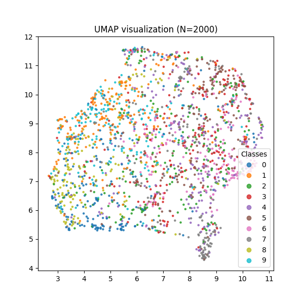

<div align="center">

# SimCLR CIFAR-10

A PyTorch implementation of SimCLR (Simple Framework for Contrastive Learning of Visual Representations) for self-supervised learning on CIFAR-10.

</div>

<div align="center">


*t-SNE visualization of learned embeddings on CIFAR-10 test set*

.png)
*UMAP visualization of learned embeddings on CIFAR-10 test set*
</div>

---

## 📋 Table of Contents

- [Overview](#overview)
- [Features](#features)
- [Project Structure](#project-structure)
- [Installation](#installation)
- [Usage](#usage)
- [Architecture](#architecture)
- [Training](#training)
- [Evaluation](#evaluation)
- [Results](#results)
- [Contributing](#contributing)
- [License](#license)
- [Acknowledgments](#acknowledgments)

## 🔍 Overview

SimCLR is a simple framework for contrastive learning of visual representations without requiring labeled data. This implementation applies SimCLR to the CIFAR-10 dataset using a ResNet backbone.

**Key Components:**
- Self-supervised pretraining using contrastive learning
- NT-Xent (Normalized Temperature-scaled Cross Entropy) loss
- Strong data augmentations (color jitter, random crop, Gaussian blur)
- Linear evaluation protocol for downstream tasks
- Embedding visualization with t-SNE and UMAP

## ✨ Features

- 🎯 **Self-Supervised Learning**: Train visual representations without labels
- 🏗️ **Modular Architecture**: Clean separation of encoder, projector, and loss components
- 📊 **Built-in Visualization**: Automatic t-SNE and UMAP embedding plots
- 💾 **Checkpoint Management**: Save and resume training from checkpoints
- 🔄 **Data Augmentations**: SimCLR-style augmentation pipeline
- 📈 **Linear Evaluation**: Evaluate learned representations with linear probing

## 📁 Project Structure

```
.
├── data/                    # CIFAR-10 dataset (downloaded automatically)
├── notebooks/               # Jupyter notebooks for experiments
├── outputs/                 # Checkpoints, plots, and logs
│   ├── checkpoints/         # Model checkpoints
│   ├── tsne_visualization.png
│   └── umap_visualization.png
├── src/
│   ├── datasets/
│   │   ├── augmentations.py # SimCLR augmentation pipeline
│   │   └── cifar10.py       # CIFAR-10 data loader with paired views
│   ├── losses/
│   │   └── nt_xent.py       # NT-Xent contrastive loss
│   ├── models/
│   │   ├── resnet.py        # ResNet backbone
│   │   └── projection.py    # Projection head (MLP)
│   ├── training/
│   │   ├── trainer.py       # SimCLR training loop
│   │   └── linear_eval.py   # Linear evaluation & visualization
│   ├── utils/
│   │   ├── checkpoint.py    # Checkpoint utilities
│   │   └── visualization.py # t-SNE/UMAP plotting
│   └── main.py              # Main training script
├── requirements.txt
├── run.sh                   # Quick start script
└── README.md
```

## 🚀 Installation

### Prerequisites
- Python 3.7+
- CUDA-capable GPU (recommended)

### Setup

1. Clone the repository:
```bash
git clone https://github.com/yourusername/simclr-cifar10.git
cd simclr-cifar10
```

2. Install dependencies:
```bash
pip install -r requirements.txt
```

**Dependencies:**
- `torch` - PyTorch framework
- `torchvision` - Vision datasets and models
- `numpy` - Numerical operations
- `matplotlib` - Plotting
- `tqdm` - Progress bars
- `scikit-learn` - t-SNE visualization
- `umap-learn` - UMAP visualization

## 💻 Usage

### Quick Start

Run the default training configuration:
```bash
bash run.sh
```

This trains SimCLR for 100 epochs with batch size 1024.

### Custom Training

Train with custom hyperparameters:
```bash
python src/main.py \
  --batch_size 512 \
  --epochs 200 \
  --lr 3e-4 \
  --temperature 0.5 \
  --save_path outputs/checkpoints
```

### Arguments

| Argument | Type | Default | Description |
|----------|------|---------|-------------|
| `--batch_size` | int | 128 | Training batch size |
| `--epochs` | int | 5 | Number of training epochs |
| `--lr` | float | 3e-4 | Learning rate |
| `--temperature` | float | 0.5 | Temperature for NT-Xent loss |
| `--save_path` | str | outputs/checkpoints | Path to save checkpoints |

## 🏗️ Architecture

### Model Components

1. **Encoder (ResNet)**: Extracts visual features from images
   - Default: ResNet-18
   - Output: 512-dimensional feature vectors

2. **Projection Head**: MLP that maps features to contrastive space
   - Architecture: `512 → 512 (ReLU) → 128`
   - Used only during training

3. **NT-Xent Loss**: Normalized temperature-scaled cross entropy
   - Maximizes agreement between augmented views
   - Temperature parameter controls distribution sharpness

### Data Augmentation Pipeline

SimCLR applies strong augmentations to create two views of each image:
- Random resized crop (32×32)
- Random horizontal flip
- Color jitter (brightness, contrast, saturation, hue)
- Random grayscale (20% probability)
- Gaussian blur (kernel size 5)
- Normalization

## 🎓 Training

### Training Process

1. **Contrastive Pretraining**:
   - Generate two augmented views for each image
   - Pass both views through encoder + projection head
   - Compute NT-Xent loss to maximize similarity between positive pairs
   - Update encoder and projection head parameters

2. **Linear Evaluation**:
   - Freeze the pretrained encoder
   - Train a linear classifier on top of frozen features
   - Measure classification accuracy on CIFAR-10

3. **Visualization**:
   - Extract embeddings from test set
   - Apply t-SNE and UMAP for 2D visualization
   - Save plots to `outputs/` directory

### Monitoring Training

The training script displays:
- Real-time loss values with progress bars
- Average loss per epoch
- Linear evaluation accuracy
- Checkpoint save confirmations

## 📊 Evaluation

### Linear Evaluation Protocol

After pretraining, the model is evaluated using a standard linear evaluation protocol:

1. Freeze the encoder weights
2. Train a linear classifier (single fully-connected layer)
3. Evaluate on CIFAR-10 test set

This measures the quality of learned representations for downstream tasks.

### Visualization

The project includes automatic embedding visualization:

- **t-SNE**: Projects high-dimensional embeddings to 2D
- **UMAP**: Alternative dimensionality reduction technique
- Both visualizations are color-coded by class labels
- Saved automatically to `outputs/` directory

## 📈 Results

### Expected Performance

With default hyperparameters (100 epochs, batch size 1024):
- Linear evaluation accuracy: ~50% on CIFAR-10
- Training time: ~2-3 hours on single GPU

### Visualizations

The learned embeddings show clear class separation in 2D projections:
- Similar classes cluster together (e.g., animals, vehicles)
- Distinct visual patterns for different object categories

Check `outputs/tsne_visualization.png` and `outputs/umap_visualization.png` after training.

## 🤝 Contributing

Contributions are welcome! Here's how you can help:

1. Fork the repository
2. Create a feature branch (`git checkout -b feature/amazing-feature`)
3. Commit your changes (`git commit -m 'Add amazing feature'`)
4. Push to the branch (`git push origin feature/amazing-feature`)
5. Open a Pull Request

### Areas for Contribution

- Support for additional datasets (ImageNet, STL-10, etc.)
- Alternative backbone architectures (Vision Transformer, etc.)
- Hyperparameter tuning and optimization
- Additional augmentation strategies
- Performance benchmarks and comparisons

## 📄 License

This project is licensed under the MIT License - see the LICENSE file for details.

## 🙏 Acknowledgments

- [SimCLR Paper](https://arxiv.org/abs/2002.05709) by Chen et al. (2020)
- PyTorch team for the excellent deep learning framework
- CIFAR-10 dataset by Krizhevsky et al.

---

**Author**: Alif Akbar Hafiz

If you find this implementation helpful, please consider giving it a ⭐!


